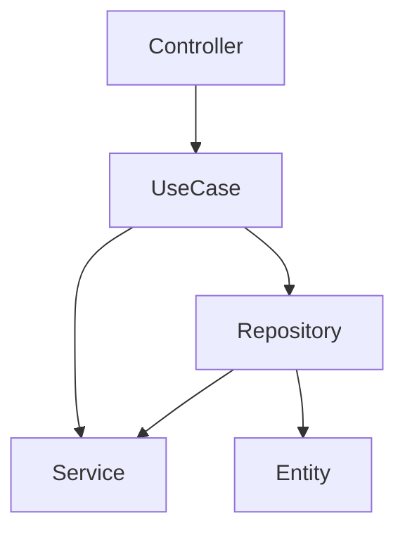

# Implements Clean Architecture with PHP

[](https://packagist.org/packages/giacomomasseron/php-clean-architecture)
[](https://github.com/giacomomasseron/php-clean-architecture/actions?query=workflow%3Arun-tests+branch%3Amain)
[](https://github.com/giacomomasseron/php-clean-architecture/actions?query=workflow%3A"Fix+PHP+code+style+issues"+branch%3Amain)
[](https://packagist.org/packages/giacomomasseron/php-clean-architecture)

Implements Clean Architecture as described by Robert C. Martin (Uncle Bob) here:      
[Clean Architecture](https://blog.cleancoder.com/uncle-bob/2012/08/13/the-clean-architecture.html)

This is an opinionated package that defines levels of the architecture and the dependencies between them.    
And uses deptrac to check if the levels are respected.

- [Installation](#installation)
- [Getting started](#Getting-started)
  - [Commands](#Commands)
    - [Make Entity](#Make-Entity)
    - [Make Repository](#Make-Repository)
    - [Make UseCase](#Make-UseCase)
    - [Make Controller](#Make-Controller)
    - [Make Service](#Make-Service)
- [Why Clean Architecture](#Why-Clean-Architecture)
- [Concepts](#Concepts)
  - [Architecture Level](#Architecture-Level)
  - [UseCase](#UseCase)
- [How it works](#How-it-works)
  - [Levels](#Levels)
  - [Define a level inside the project](#Define-a-level-inside-the-project)
  - [UseCases](#UseCases)
    - [BaseUseCase](#BaseUseCase)
    - [Events](#events)
- [CI/CD](#CICD)
- [Testing](#testing)
- [Frameworks](#frameworks)
  - [Laravel](#laravel)
    - [Pulse](#pulse) 

## Installation

You can install the package via composer:

```bash  
composer require giacomomasseron/php-clean-architecture
```  
  
After the installation, you must run the *install* command to publish the *deptrac.yaml* and the *php-clean-architecture.yaml* config files to your root folder:  

```bash  
vendor/bin/php-clean-architecture install
```  
  
## Getting started  
  
To check the architecture levels in your project, use the following command:  
  
```bash  
vendor/bin/php-clean-architecture check
```  
  
### Commands  
  
All commands read the *php-clean-architecture.yaml* config file to know where to put the files created and which namespace they belong to.  
  
#### Make Entity  
  
To create an Entity, you can use the following command:  
  
```bash  
vendor/bin/php-clean-architecture make:entity EntityInYourProject
```  
  
#### Make Repository  
  
To create a Repository, you can use the following command:  
  
```bash  
vendor/bin/php-clean-architecture make:repository UserRepository
```  
  
#### Make UseCase  
  
To create a UseCase, you can use the following command:  
  
```bash  
vendor/bin/php-clean-architecture make:usecase DoSomethingUseCase
```  
  
#### Make Controller  
  
To create a Controller, you can use the following command:  
  
```bash  
vendor/bin/php-clean-architecture make:controller UserController
```  
  
#### Make Service  
  
To create a Service, you can use the following command:  
  
```bash  
vendor/bin/php-clean-architecture make:service ThirdyPartyServicevendor/bin/php-clean-architecture make:service ThirdyParty
```  
  
In both cases, the created class will be named *ThirdyPartyService*.  
  
## Why Clean Architecture?  
  
Why not?    
It is a well-known, well-structured architecture system.  
  
## Concepts  
  
### Architecture Level  
  
In the Clean Architecture, a level is a layer of the architecture with a specific function, **only connected to the upper level**.  
  
The rule of thumb of the Clean Architecture is:    
**An inner circle must never know anything about the circles around it**.  
  
### UseCase  
  
UseCase is a concept of Use Cases level.  
  
A UseCase is every action your project performs.    
Good examples of use cases are:  
- Login  
- Register  
- CompleteOrder  
- UpdateProfile  
  
**A use case should be a single, very specific action. It shouldn’t do anything more than its name suggests.**  
  
## How it works  
  
The package uses [deptrac](https://github.com/deptrac/deptrac) to define the levels and to check the dependencies between them.  
  
### Levels  
  
These are the levels defined:  
  
- Entity  
- Repository  
- UseCase  
- Controller  
- Service  
  
These are the dependencies between the levels:  
  


The *Entity* level must not depend on any other level.    
The *Repository* level can only depend on *Entity* or *Service* levels.    
The *UseCase* level can only depend on *Repository* or *Service* levels.    
The *Controller* level can only depend on *UseCase* levels.

**What is the Service level?**  
The Service level can be used for third-party tools or libraries.

### Define a level inside the project

The package comes with these interfaces:

- **EntityInterface**: implement this interface if the class belongs to the Entity level.
- **RepositoryInterface**: implement this interface if the class belongs to the Repository level.
- **UseCaseInterface**: implement this interface if the class belongs to the UseCase level.
- **ControllerInterface**: implement this interface if the class belongs to the Controller level.

For classes that belong to the Service level, the class name must contain the *Service* word.  
For example:

```php  
final public class ThirdPartyService  
```  


If you want your controller to be part of the Controller level, you need to implement the ControllerInterface.    
For example:

```php  
use GiacomoMasseroni\PHPCleanArchitecture\Contracts\ControllerInterface;  
  
public class YourController implements ControllerInterface  
```  

### UseCases

When you create a UseCase, the class needs to extend the BaseUseCase class, and you need to implement the UseCaseInterface.  
For example:

```php  
use GiacomoMasseroni\PHPCleanArchitecture\BaseUseCase;  
use GiacomoMasseroni\PHPCleanArchitecture\Contracts\UseCaseInterface;  
  
public class DoSomething extends BaseUseCase implements UseCaseInterface  
{  
    public function handle(...$arguments): mixed
    { 
        // 
    }
}  
```  

To execute the UseCase, you need to call the *run* method defined in the BaseUseCase class:

```php  
DoSomething::run($arg1, $arg2);  
```  

#### BaseUseCase

The package defines an abstract class for use cases: *BaseUseCase*.    
This class defines variable for the user executing the use case:

```php  
UseCaseExecutorInterface $executor
```   

You can set the executor using the following example:  
  
```php  
DoSomething::actingAs($user)->run($arg1, $arg2);  
```  

If you need to rollback the use case, you can override the *rollback* method:

```php  
public function rollback(): void  
{  
}  
```  

#### Events

The package dispatches two events, one when the use case starts, and one when the use case ends.  
It uses the [Symfony Event Dispatcher Component](https://symfony.com/doc/current/components/event_dispatcher.html).

The events are:

- UseCaseStartedEvent
- UseCaseCompletedEvent

## CI/CD

If you want to check the architecture levels in your CI/CD pipeline, you can use the following command:

```bash  
vendor/bin/php-clean-architecture check
```  
  
This command will stop your pipeline if there are architecture violations, based on the deptrac configuration file.  

## Testing

```bash  
composer test
```  

## Frameworks

### Laravel

[I wrote an article on how to use this package with Laravel](https://dev.to/giacomomasseron/clean-architecture-in-a-laravel-project-3oh3)

#### Pulse

Laravel pulse is a package that helps you to monitor the health of your Laravel application.  
If you want to monitor use cases execution time, you can:

- Create two laravel events, ```UseCaseStarted``` and ```UseCaseCompleted```
- Create a Pulse card that listens to these events and measures the execution time.
- Add this code to ```register``` function in ```AppServiceProvider.php``` file:
    ```php 
    \GiacomoMasseroni\PHPCleanArchitecture\Dispatcher::getInstance()->addListener(\GiacomoMasseroni\PHPCleanArchitecture\Events\UseCaseStartedEvent::class, function (\GiacomoMasseroni\PHPCleanArchitecture\Events\UseCaseStartedEvent $event): void {
        // Just propagate the event to Laravel event system
        \App\Events\UseCaseStarted::dispatch($event->useCase);
    });
    
    \GiacomoMasseroni\PHPCleanArchitecture\Dispatcher::getInstance()->addListener(\GiacomoMasseroni\PHPCleanArchitecture\Events\UseCaseCompletedEvent::class, function (\GiacomoMasseroni\PHPCleanArchitecture\Events\UseCaseCompletedEvent $event): void {
        // Just propagate the event to Laravel event system
        \App\Events\UseCaseCompleted::dispatch($event->useCase);
    });
    ```


## Changelog  
  
Please see [CHANGELOG](CHANGELOG.md) for more information on what has changed recently.  
  
## Contributing  
  
Please see [CONTRIBUTING](CONTRIBUTING.md) for details.  
  
## Security Vulnerabilities  
  
Please review [our security policy](../../security/policy) on how to report security vulnerabilities.  
  
## Credits  
  
- [Giacomo Masseroni](https://github.com/giacomomasseron)  
- [All Contributors](../../contributors)  
  
## License  
  
The MIT License (MIT). Please see [License File](LICENSE.md) for more information.